# Project 3 — CDC & Orchestrated Lakehouse Pipeline

.env values are the same as .env.example (just to simplfy running project).

Used jupyter notebook project3.ipynb for testing things and most pictures are taken from there.

Starting Airflow might take some time since it installs pyspark.

## 1. CDC Correctness

### Silver Mirrors PostgreSQL

The validation task compares PostgreSQL tables with Silver Iceberg tables.

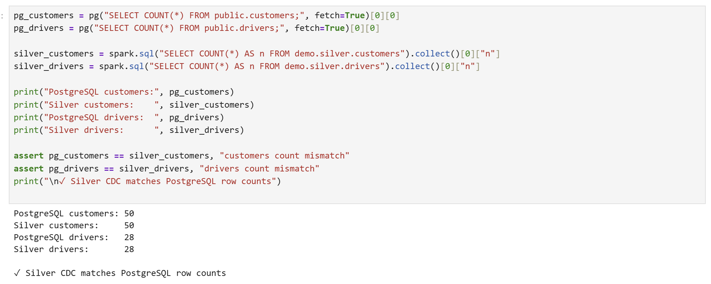

Spot-check validation:

* customers IDs: 1, 2, 3 → Match
* drivers IDs: 1, 3, 5 → Match

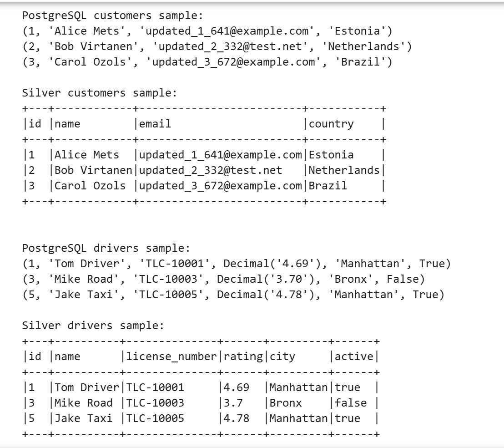

Validation output:

```
customers: postgres=50, silver=50
customers: spot-check passed for id=1
customers: spot-check passed for id=2
customers: spot-check passed for id=3
drivers: postgres=28, silver=28
drivers: spot-check passed for id=1
drivers: spot-check passed for id=3
drivers: spot-check passed for id=5
Validation passed: Silver CDC matches PostgreSQL counts and sampled rows.
```

### Delete Propagation

Deletes are captured by Debezium as `op='d'`.
During the Silver MERGE step:

* `op='d'` → row is removed from Silver

Observed behavior:

* Deleted rows in PostgreSQL no longer appear in Silver
* Row counts decrease accordingly

Inserting new row.
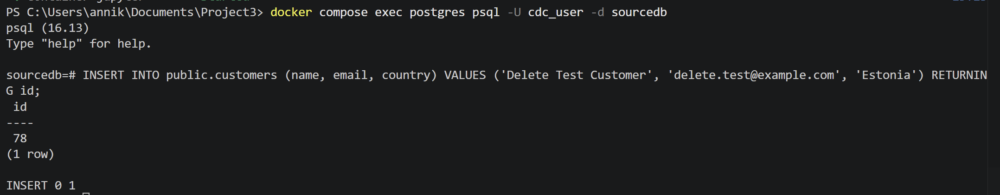
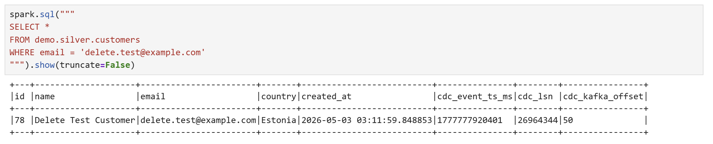
Deleting row and it no longer appears in Silver.
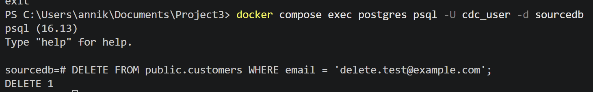
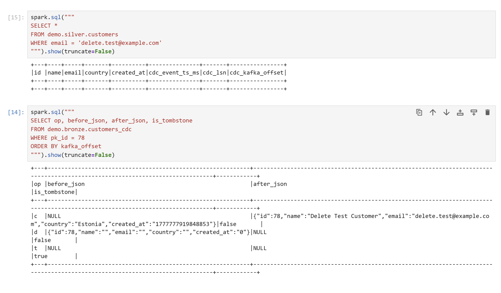

### Idempotency

The DAG was run multiple times with no new input data:

* Row counts remained unchanged
* No duplicate rows were created

This is guaranteed because:

* Bronze ingestion deduplicates Kafka offsets
* Silver uses deterministic `ROW_NUMBER()` logic
* MERGE operations produce the same result on re-run

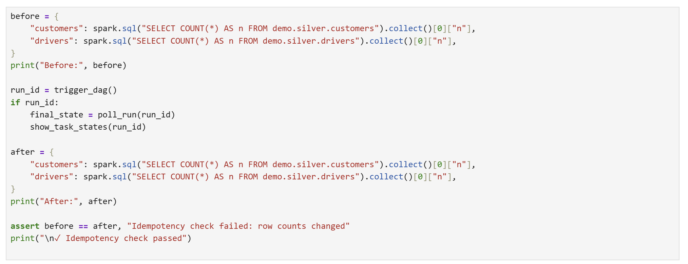
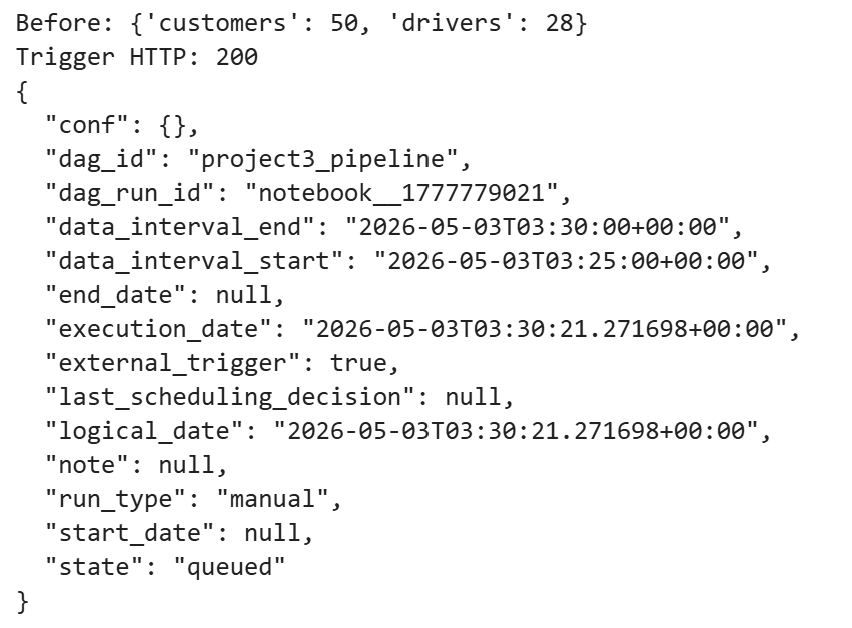
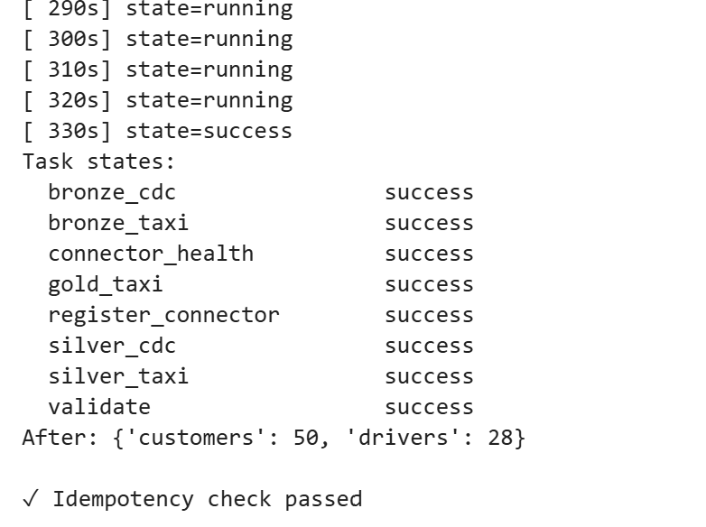

---

## 2. Lakehouse Design

### Bronze CDC

Tables:

* `demo.bronze.customers_cdc`
* `demo.bronze.drivers_cdc`

Schema includes:

* Kafka metadata (partition, offset, timestamp)
* CDC metadata (`op`, `lsn`, `event_ts_ms`)
* Raw JSON (`before_json`, `after_json`)

Purpose:

* Immutable event log
* Stores every change event
* Supports replay and auditing

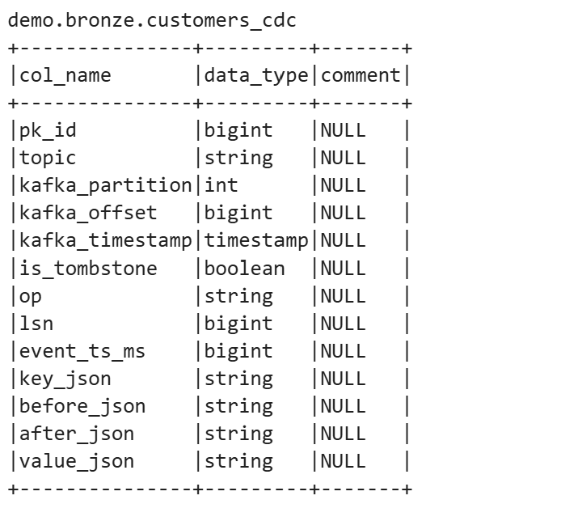
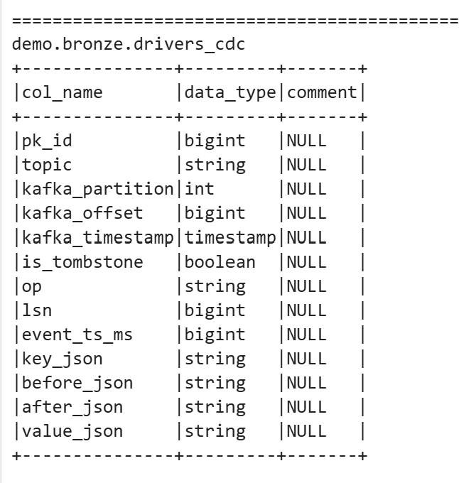

---

### Silver CDC

Tables:

* `demo.silver.customers`
* `demo.silver.drivers`

Contains:

* Cleaned, typed columns
* CDC metadata fields for traceability

Difference from Bronze:

* Only latest record per primary key
* Represents current state of PostgreSQL

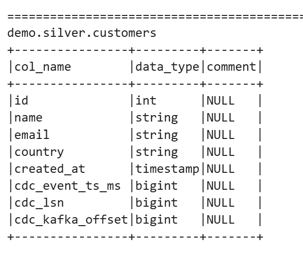
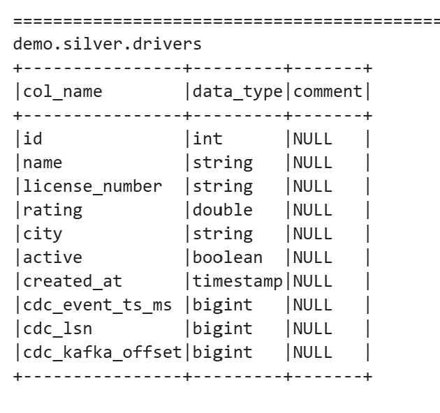

---

### Bronze Taxi

Table:

* `demo.bronze.stg_taxi`

Stores:

* Raw Kafka events
* JSON payload
* Kafka offsets

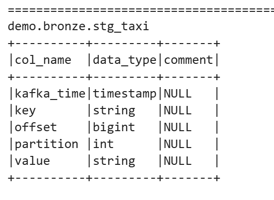

---

### Silver Taxi

Table:

* `demo.silver.fct_taxi_trip`

Transforms:

* Parses timestamps
* Casts numeric fields
* Removes invalid trips
* Enriches with zone names

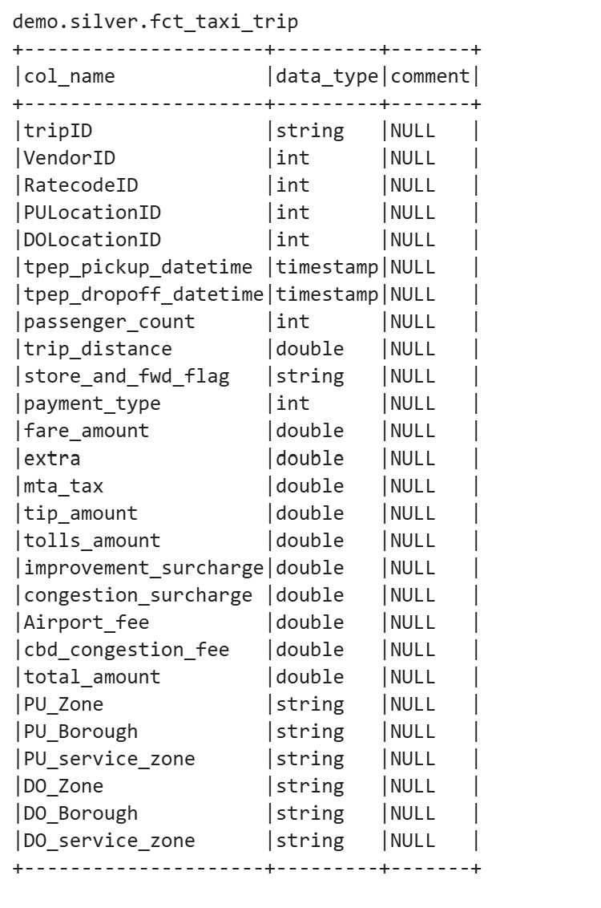

---

### Gold Taxi

Tables:

* `demo.gold.analytical_taxi_trips`
* `demo.gold.taxi_zone_hourly_metrics`

Aggregates:

* Trip count
* Average fare
* Average duration
* Metrics grouped by pickup zone and hour

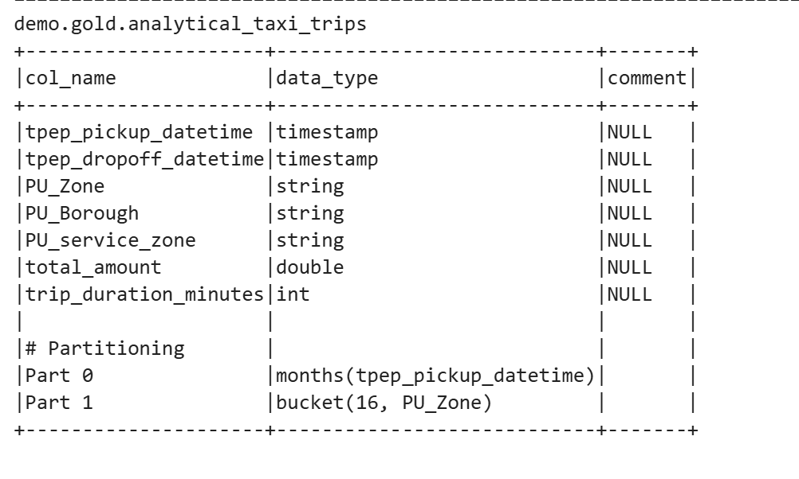
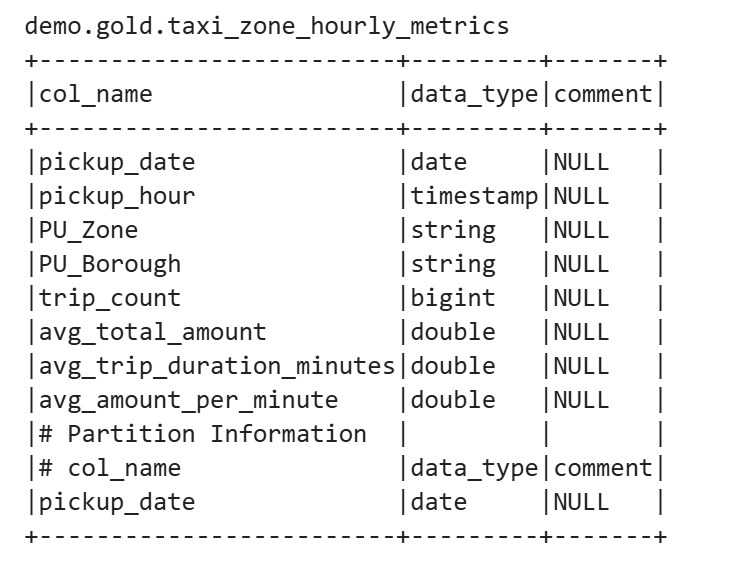

---

### Iceberg Snapshot History

Query:

```sql
SELECT * 
FROM demo.silver.customers.snapshots
ORDER BY committed_at DESC;
```

================================================================================
demo.silver.customers.snapshots
+-----------------------+-------------------+-------------------+---------+-------------------------------------------------------------------------------------------------------------+--------------------------------------------------------------------------------------------------------------------------------------------------------------------------------------------------------------------------------------------------------------------------------------------------------------------------------------------------------------------------------------------------------------------------------------------------------------------------------------------------------------------------------------------------------+
|committed_at           |snapshot_id        |parent_id          |operation|manifest_list                                                                                                |summary                                                                                                                                                                                                                                                                                                                                                                                                                                                                                                                                                 |
+-----------------------+-------------------+-------------------+---------+-------------------------------------------------------------------------------------------------------------+--------------------------------------------------------------------------------------------------------------------------------------------------------------------------------------------------------------------------------------------------------------------------------------------------------------------------------------------------------------------------------------------------------------------------------------------------------------------------------------------------------------------------------------------------------+
|2026-05-03 03:37:41.676|7062148845741428783|3153473186116855083|overwrite|s3://warehouse/silver/customers/metadata/snap-7062148845741428783-1-4da80efb-ea2f-4b07-a4bb-94aa3c6647d5.avro|{spark.app.id -> local-1777779448020, added-data-files -> 1, deleted-data-files -> 1, added-records -> 50, deleted-records -> 50, added-files-size -> 4154, removed-files-size -> 4154, changed-partition-count -> 1, total-records -> 50, total-files-size -> 4154, total-data-files -> 1, total-delete-files -> 0, total-position-deletes -> 0, total-equality-deletes -> 0, engine-version -> 4.1.0, app-id -> local-1777779448020, engine-name -> spark, iceberg-version -> Apache Iceberg 1.10.0 (commit 2114bf631e49af532d66e2ce148ee49dd1dd1f1f)}|
|2026-05-03 03:34:30.758|3153473186116855083|1507900816926303422|overwrite|s3://warehouse/silver/customers/metadata/snap-3153473186116855083-1-2f5ed416-13fd-477f-9818-d04ebeebf171.avro|{spark.app.id -> local-1777779255347, added-data-files -> 1, deleted-data-files -> 1, added-records -> 50, deleted-records -> 50, added-files-size -> 4154, removed-files-size -> 4154, changed-partition-count -> 1, total-records -> 50, total-files-size -> 4154, total-data-files -> 1, total-delete-files -> 0, total-position-deletes -> 0, total-equality-deletes -> 0, engine-version -> 4.1.0, app-id -> local-1777779255347, engine-name -> spark, iceberg-version -> Apache Iceberg 1.10.0 (commit 2114bf631e49af532d66e2ce148ee49dd1dd1f1f)}|
|2026-05-03 03:31:53.292|1507900816926303422|6483451385430272618|overwrite|s3://warehouse/silver/customers/metadata/snap-1507900816926303422-1-2f05b596-b92c-4f41-94a6-f41ba8dd23d8.avro|{spark.app.id -> local-1777779098828, added-data-files -> 1, deleted-data-files -> 1, added-records -> 50, deleted-records -> 50, added-files-size -> 4154, removed-files-size -> 4154, changed-partition-count -> 1, total-records -> 50, total-files-size -> 4154, total-data-files -> 1, total-delete-files -> 0, total-position-deletes -> 0, total-equality-deletes -> 0, engine-version -> 4.1.0, app-id -> local-1777779098828, engine-name -> spark, iceberg-version -> Apache Iceberg 1.10.0 (commit 2114bf631e49af532d66e2ce148ee49dd1dd1f1f)}|
|2026-05-03 03:21:42.076|6483451385430272618|7630222710045960844|overwrite|s3://warehouse/silver/customers/metadata/snap-6483451385430272618-1-b5db3b5c-777f-4e47-a506-e68724fb6adf.avro|{spark.app.id -> local-1777778488208, added-data-files -> 1, deleted-data-files -> 1, added-records -> 50, deleted-records -> 51, added-files-size -> 4154, removed-files-size -> 4201, changed-partition-count -> 1, total-records -> 50, total-files-size -> 4154, total-data-files -> 1, total-delete-files -> 0, total-position-deletes -> 0, total-equality-deletes -> 0, engine-version -> 4.1.0, app-id -> local-1777778488208, engine-name -> spark, iceberg-version -> Apache Iceberg 1.10.0 (commit 2114bf631e49af532d66e2ce148ee49dd1dd1f1f)}|
|2026-05-03 03:18:09.399|7630222710045960844|7557350134518083260|overwrite|s3://warehouse/silver/customers/metadata/snap-7630222710045960844-1-69fa5273-4d0a-4b5a-aab4-e705f0f07647.avro|{spark.app.id -> local-1777778275604, added-data-files -> 1, deleted-data-files -> 1, added-records -> 51, deleted-records -> 51, added-files-size -> 4201, removed-files-size -> 4201, changed-partition-count -> 1, total-records -> 51, total-files-size -> 4201, total-data-files -> 1, total-delete-files -> 0, total-position-deletes -> 0, total-equality-deletes -> 0, engine-version -> 4.1.0, app-id -> local-1777778275604, engine-name -> spark, iceberg-version -> Apache Iceberg 1.10.0 (commit 2114bf631e49af532d66e2ce148ee49dd1dd1f1f)}|
|2026-05-03 03:15:26.395|7557350134518083260|237966960274289942 |overwrite|s3://warehouse/silver/customers/metadata/snap-7557350134518083260-1-f966f78a-4bd2-40ab-a72d-073f2db407b2.avro|{spark.app.id -> local-1777778111900, added-data-files -> 1, deleted-data-files -> 1, added-records -> 51, deleted-records -> 50, added-files-size -> 4201, removed-files-size -> 4154, changed-partition-count -> 1, total-records -> 51, total-files-size -> 4201, total-data-files -> 1, total-delete-files -> 0, total-position-deletes -> 0, total-equality-deletes -> 0, engine-version -> 4.1.0, app-id -> local-1777778111900, engine-name -> spark, iceberg-version -> Apache Iceberg 1.10.0 (commit 2114bf631e49af532d66e2ce148ee49dd1dd1f1f)}|
|2026-05-03 03:11:37.118|237966960274289942 |4142675863625265855|overwrite|s3://warehouse/silver/customers/metadata/snap-237966960274289942-1-493ea247-4f98-462d-ae4d-9cca6dc4ac1c.avro |{spark.app.id -> local-1777777880780, added-data-files -> 1, deleted-data-files -> 1, added-records -> 50, deleted-records -> 50, added-files-size -> 4154, removed-files-size -> 4154, changed-partition-count -> 1, total-records -> 50, total-files-size -> 4154, total-data-files -> 1, total-delete-files -> 0, total-position-deletes -> 0, total-equality-deletes -> 0, engine-version -> 4.1.0, app-id -> local-1777777880780, engine-name -> spark, iceberg-version -> Apache Iceberg 1.10.0 (commit 2114bf631e49af532d66e2ce148ee49dd1dd1f1f)}|
|2026-05-03 03:08:15.316|4142675863625265855|NULL               |append   |s3://warehouse/silver/customers/metadata/snap-4142675863625265855-1-b28501ed-9fc3-496f-95e9-6595de7f9abd.avro|{spark.app.id -> local-1777777682887, added-data-files -> 1, added-records -> 50, added-files-size -> 4154, changed-partition-count -> 1, total-records -> 50, total-files-size -> 4154, total-data-files -> 1, total-delete-files -> 0, total-position-deletes -> 0, total-equality-deletes -> 0, engine-version -> 4.1.0, app-id -> local-1777777682887, engine-name -> spark, iceberg-version -> Apache Iceberg 1.10.0 (commit 2114bf631e49af532d66e2ce148ee49dd1dd1f1f)}                                                                            |
+-----------------------+-------------------+-------------------+---------+-------------------------------------------------------------------------------------------------------------+--------------------------------------------------------------------------------------------------------------------------------------------------------------------------------------------------------------------------------------------------------------------------------------------------------------------------------------------------------------------------------------------------------------------------------------------------------------------------------------------------------------------------------------------------------+


================================================================================
demo.silver.drivers.snapshots
+-----------------------+-------------------+-------------------+---------+-----------------------------------------------------------------------------------------------------------+--------------------------------------------------------------------------------------------------------------------------------------------------------------------------------------------------------------------------------------------------------------------------------------------------------------------------------------------------------------------------------------------------------------------------------------------------------------------------------------------------------------------------------------------------------+
|committed_at           |snapshot_id        |parent_id          |operation|manifest_list                                                                                              |summary                                                                                                                                                                                                                                                                                                                                                                                                                                                                                                                                                 |
+-----------------------+-------------------+-------------------+---------+-----------------------------------------------------------------------------------------------------------+--------------------------------------------------------------------------------------------------------------------------------------------------------------------------------------------------------------------------------------------------------------------------------------------------------------------------------------------------------------------------------------------------------------------------------------------------------------------------------------------------------------------------------------------------------+
|2026-05-03 03:37:43.727|3550984257228844583|7253557141175406055|overwrite|s3://warehouse/silver/drivers/metadata/snap-3550984257228844583-1-971adefb-c50d-4e5d-96af-393946be0da9.avro|{spark.app.id -> local-1777779448020, added-data-files -> 1, deleted-data-files -> 1, added-records -> 28, deleted-records -> 28, added-files-size -> 3926, removed-files-size -> 3926, changed-partition-count -> 1, total-records -> 28, total-files-size -> 3926, total-data-files -> 1, total-delete-files -> 0, total-position-deletes -> 0, total-equality-deletes -> 0, engine-version -> 4.1.0, app-id -> local-1777779448020, engine-name -> spark, iceberg-version -> Apache Iceberg 1.10.0 (commit 2114bf631e49af532d66e2ce148ee49dd1dd1f1f)}|
|2026-05-03 03:34:32.697|7253557141175406055|6368384596970471972|overwrite|s3://warehouse/silver/drivers/metadata/snap-7253557141175406055-1-e20e564b-94d0-4195-9cb1-cd6adb0dc257.avro|{spark.app.id -> local-1777779255347, added-data-files -> 1, deleted-data-files -> 1, added-records -> 28, deleted-records -> 28, added-files-size -> 3926, removed-files-size -> 3926, changed-partition-count -> 1, total-records -> 28, total-files-size -> 3926, total-data-files -> 1, total-delete-files -> 0, total-position-deletes -> 0, total-equality-deletes -> 0, engine-version -> 4.1.0, app-id -> local-1777779255347, engine-name -> spark, iceberg-version -> Apache Iceberg 1.10.0 (commit 2114bf631e49af532d66e2ce148ee49dd1dd1f1f)}|
|2026-05-03 03:31:54.866|6368384596970471972|8953544307087829835|overwrite|s3://warehouse/silver/drivers/metadata/snap-6368384596970471972-1-cd445f71-ade5-4e0a-81ba-ea7779fe7953.avro|{spark.app.id -> local-1777779098828, added-data-files -> 1, deleted-data-files -> 1, added-records -> 28, deleted-records -> 28, added-files-size -> 3926, removed-files-size -> 3926, changed-partition-count -> 1, total-records -> 28, total-files-size -> 3926, total-data-files -> 1, total-delete-files -> 0, total-position-deletes -> 0, total-equality-deletes -> 0, engine-version -> 4.1.0, app-id -> local-1777779098828, engine-name -> spark, iceberg-version -> Apache Iceberg 1.10.0 (commit 2114bf631e49af532d66e2ce148ee49dd1dd1f1f)}|
|2026-05-03 03:21:43.894|8953544307087829835|3749372199225902238|overwrite|s3://warehouse/silver/drivers/metadata/snap-8953544307087829835-1-6f6872c1-6f9f-4586-9ed5-e0e700c62776.avro|{spark.app.id -> local-1777778488208, added-data-files -> 1, deleted-data-files -> 1, added-records -> 28, deleted-records -> 28, added-files-size -> 3926, removed-files-size -> 3926, changed-partition-count -> 1, total-records -> 28, total-files-size -> 3926, total-data-files -> 1, total-delete-files -> 0, total-position-deletes -> 0, total-equality-deletes -> 0, engine-version -> 4.1.0, app-id -> local-1777778488208, engine-name -> spark, iceberg-version -> Apache Iceberg 1.10.0 (commit 2114bf631e49af532d66e2ce148ee49dd1dd1f1f)}|
|2026-05-03 03:18:11.148|3749372199225902238|6159003562568102341|overwrite|s3://warehouse/silver/drivers/metadata/snap-3749372199225902238-1-455cdd98-c1e8-4847-9e3f-c38ca3d0b113.avro|{spark.app.id -> local-1777778275604, added-data-files -> 1, deleted-data-files -> 1, added-records -> 28, deleted-records -> 28, added-files-size -> 3926, removed-files-size -> 3926, changed-partition-count -> 1, total-records -> 28, total-files-size -> 3926, total-data-files -> 1, total-delete-files -> 0, total-position-deletes -> 0, total-equality-deletes -> 0, engine-version -> 4.1.0, app-id -> local-1777778275604, engine-name -> spark, iceberg-version -> Apache Iceberg 1.10.0 (commit 2114bf631e49af532d66e2ce148ee49dd1dd1f1f)}|
|2026-05-03 03:15:28.461|6159003562568102341|8094084351565846505|overwrite|s3://warehouse/silver/drivers/metadata/snap-6159003562568102341-1-e391a0c5-9647-4f78-ad32-69e548667fb8.avro|{spark.app.id -> local-1777778111900, added-data-files -> 1, deleted-data-files -> 1, added-records -> 28, deleted-records -> 28, added-files-size -> 3926, removed-files-size -> 3926, changed-partition-count -> 1, total-records -> 28, total-files-size -> 3926, total-data-files -> 1, total-delete-files -> 0, total-position-deletes -> 0, total-equality-deletes -> 0, engine-version -> 4.1.0, app-id -> local-1777778111900, engine-name -> spark, iceberg-version -> Apache Iceberg 1.10.0 (commit 2114bf631e49af532d66e2ce148ee49dd1dd1f1f)}|
|2026-05-03 03:11:39.536|8094084351565846505|6294093181677771477|overwrite|s3://warehouse/silver/drivers/metadata/snap-8094084351565846505-1-7598e8e9-532d-40c0-b8ea-7ada9c1c7c75.avro|{spark.app.id -> local-1777777880780, added-data-files -> 1, deleted-data-files -> 1, added-records -> 28, deleted-records -> 28, added-files-size -> 3926, removed-files-size -> 3926, changed-partition-count -> 1, total-records -> 28, total-files-size -> 3926, total-data-files -> 1, total-delete-files -> 0, total-position-deletes -> 0, total-equality-deletes -> 0, engine-version -> 4.1.0, app-id -> local-1777777880780, engine-name -> spark, iceberg-version -> Apache Iceberg 1.10.0 (commit 2114bf631e49af532d66e2ce148ee49dd1dd1f1f)}|
|2026-05-03 03:08:16.846|6294093181677771477|NULL               |append   |s3://warehouse/silver/drivers/metadata/snap-6294093181677771477-1-5e12fb82-cbad-4f54-a7c4-d03c3e4fadd6.avro|{spark.app.id -> local-1777777682887, added-data-files -> 1, added-records -> 28, added-files-size -> 3926, changed-partition-count -> 1, total-records -> 28, total-files-size -> 3926, total-data-files -> 1, total-delete-files -> 0, total-position-deletes -> 0, total-equality-deletes -> 0, engine-version -> 4.1.0, app-id -> local-1777777682887, engine-name -> spark, iceberg-version -> Apache Iceberg 1.10.0 (commit 2114bf631e49af532d66e2ce148ee49dd1dd1f1f)}                                                                            |
+-----------------------+-------------------+-------------------+---------+-----------------------------------------------------------------------------------------------------------+--------------------------------------------------------------------------------------------------------------------------------------------------------------------------------------------------------------------------------------------------------------------------------------------------------------------------------------------------------------------------------------------------------------------------------------------------------------------------------------------------------------------------------------------------------+

---

### Time Travel & Rollback

Time travel query:

```sql
SELECT COUNT(*) 
FROM demo.silver.customers VERSION AS OF 4200449033602875954;
```

Result:

* Old version: 10 rows
* Current version: 50 rows

Rollback approach:

```sql
CALL demo.system.rollback_to_snapshot('silver.customers', <snapshot_id>);
```

This allows reverting to a previous consistent state after a bad MERGE.

---

## 3. Orchestration Design

### DAG Structure

Task flow:

```
register_connector → connector_health → [bronze_cdc, bronze_taxi]

bronze_cdc → silver_cdc → validate
bronze_taxi → silver_taxi → gold_taxi
```

Explanation:

* Connector must be running before ingestion
* Bronze loads raw data
* Silver transforms and merges
* Gold aggregates
* Validation ensures correctness

---

### Scheduling Strategy

```
schedule_interval = "*/5 * * * *"
```

* Runs every 5 minutes
* Freshness SLA ≈ 5 minutes
* Avoids Spark job overlap
* Uses `max_active_runs=1`

---

### Retry and Failure Handling

* `retries = 1` configured
* Failed tasks automatically retried

Example:

* Validation failed while simulator was running
* After stopping simulator, retry succeeded

---

### DAG Run History

At least three consecutive successful runs were observed in Airflow.

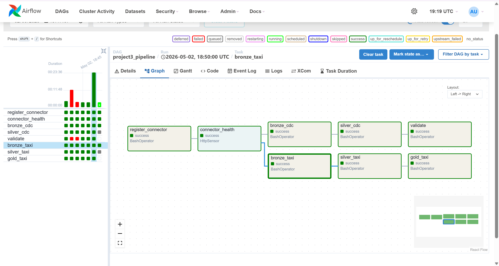

---

### Backfill

Backfill works because:

* Bronze reads Kafka from earliest offsets
* Silver rebuild is deterministic
* Re-running DAG reconstructs state correctly

---

## 4. Streaming Pipeline (Taxi)

### Verification

Taxi pipeline validated by:

* Non-zero row counts in Bronze, Silver, Gold
* Correct schema and values
* Aggregations produced expected metrics

[{"id":"ff68c6bc","cell_type":"code","source":"for table in [\n    \"demo.bronze.stg_taxi\",\n    \"demo.silver.fct_taxi_trip\",\n    \"demo.gold.analytical_taxi_trips\",\n    \"demo.gold.taxi_zone_hourly_metrics\",\n]:\n    print(\"\\n\" + \"=\" * 80)\n    print(table)\n    spark.sql(f\"SELECT COUNT(*) AS n FROM {table}\").show()\n    spark.sql(f\"SELECT * FROM {table} LIMIT 5\").show(truncate=False)\n","metadata":{"trusted":true},"outputs":[{"name":"stdout","output_type":"stream","text":"\n================================================================================\ndemo.bronze.stg_taxi\n+---+\n|  n|\n+---+\n|177|\n+---+\n\n+-----------------------+---+------+---------+---------------------------------------------------------------------------------------------------------------------------------------------------------------------------------------------------------------------------------------------------------------------------------------------------------------------------------------------------------------------------------------------------------------------------------------------------------------------------------------------------+\n|kafka_time             |key|offset|partition|value                                                                                                                                                                                                                                                                                                                                                                                                                                                                                              |\n+-----------------------+---+------+---------+---------------------------------------------------------------------------------------------------------------------------------------------------------------------------------------------------------------------------------------------------------------------------------------------------------------------------------------------------------------------------------------------------------------------------------------------------------------------------------------------------+\n|2026-05-03 03:10:19.824|1  |0     |0        |{\"VendorID\": 1, \"tpep_pickup_datetime\": \"2025-01-01T00:18:38\", \"tpep_dropoff_datetime\": \"2025-01-01T00:26:59\", \"passenger_count\": 1.0, \"trip_distance\": 1.6, \"RatecodeID\": 1.0, \"store_and_fwd_flag\": \"N\", \"PULocationID\": 229, \"DOLocationID\": 237, \"payment_type\": 1, \"fare_amount\": 10.0, \"extra\": 3.5, \"mta_tax\": 0.5, \"tip_amount\": 3.0, \"tolls_amount\": 0.0, \"improvement_surcharge\": 1.0, \"total_amount\": 18.0, \"congestion_surcharge\": 2.5, \"Airport_fee\": 0.0, \"cbd_congestion_fee\": 0.0} |\n|2026-05-03 03:10:20.062|1  |1     |0        |{\"VendorID\": 1, \"tpep_pickup_datetime\": \"2025-01-01T00:32:40\", \"tpep_dropoff_datetime\": \"2025-01-01T00:35:13\", \"passenger_count\": 1.0, \"trip_distance\": 0.5, \"RatecodeID\": 1.0, \"store_and_fwd_flag\": \"N\", \"PULocationID\": 236, \"DOLocationID\": 237, \"payment_type\": 1, \"fare_amount\": 5.1, \"extra\": 3.5, \"mta_tax\": 0.5, \"tip_amount\": 2.02, \"tolls_amount\": 0.0, \"improvement_surcharge\": 1.0, \"total_amount\": 12.12, \"congestion_surcharge\": 2.5, \"Airport_fee\": 0.0, \"cbd_congestion_fee\": 0.0}|\n|2026-05-03 03:10:20.264|1  |2     |0        |{\"VendorID\": 1, \"tpep_pickup_datetime\": \"2025-01-01T00:44:04\", \"tpep_dropoff_datetime\": \"2025-01-01T00:46:01\", \"passenger_count\": 1.0, \"trip_distance\": 0.6, \"RatecodeID\": 1.0, \"store_and_fwd_flag\": \"N\", \"PULocationID\": 141, \"DOLocationID\": 141, \"payment_type\": 1, \"fare_amount\": 5.1, \"extra\": 3.5, \"mta_tax\": 0.5, \"tip_amount\": 2.0, \"tolls_amount\": 0.0, \"improvement_surcharge\": 1.0, \"total_amount\": 12.1, \"congestion_surcharge\": 2.5, \"Airport_fee\": 0.0, \"cbd_congestion_fee\": 0.0}  |\n|2026-05-03 03:10:20.465|2  |3     |0        |{\"VendorID\": 2, \"tpep_pickup_datetime\": \"2025-01-01T00:14:27\", \"tpep_dropoff_datetime\": \"2025-01-01T00:20:01\", \"passenger_count\": 3.0, \"trip_distance\": 0.52, \"RatecodeID\": 1.0, \"store_and_fwd_flag\": \"N\", \"PULocationID\": 244, \"DOLocationID\": 244, \"payment_type\": 2, \"fare_amount\": 7.2, \"extra\": 1.0, \"mta_tax\": 0.5, \"tip_amount\": 0.0, \"tolls_amount\": 0.0, \"improvement_surcharge\": 1.0, \"total_amount\": 9.7, \"congestion_surcharge\": 0.0, \"Airport_fee\": 0.0, \"cbd_congestion_fee\": 0.0}  |\n|2026-05-03 03:10:20.668|2  |4     |0        |{\"VendorID\": 2, \"tpep_pickup_datetime\": \"2025-01-01T00:21:34\", \"tpep_dropoff_datetime\": \"2025-01-01T00:25:06\", \"passenger_count\": 3.0, \"trip_distance\": 0.66, \"RatecodeID\": 1.0, \"store_and_fwd_flag\": \"N\", \"PULocationID\": 244, \"DOLocationID\": 116, \"payment_type\": 2, \"fare_amount\": 5.8, \"extra\": 1.0, \"mta_tax\": 0.5, \"tip_amount\": 0.0, \"tolls_amount\": 0.0, \"improvement_surcharge\": 1.0, \"total_amount\": 8.3, \"congestion_surcharge\": 0.0, \"Airport_fee\": 0.0, \"cbd_congestion_fee\": 0.0}  |\n+-----------------------+---+------+---------+---------------------------------------------------------------------------------------------------------------------------------------------------------------------------------------------------------------------------------------------------------------------------------------------------------------------------------------------------------------------------------------------------------------------------------------------------------------------------------------------------+\n\n\n================================================================================\ndemo.silver.fct_taxi_trip\n+---+\n|  n|\n+---+\n|172|\n+---+\n\n+----------------------------------------------------------------+--------+----------+------------+------------+--------------------+---------------------+---------------+-------------+------------------+------------+-----------+-----+-------+----------+------------+---------------------+--------------------+-----------+------------------+------------+-------------------------+----------+---------------+---------------------+----------+---------------+\n|tripID                                                          |VendorID|RatecodeID|PULocationID|DOLocationID|tpep_pickup_datetime|tpep_dropoff_datetime|passenger_count|trip_distance|store_and_fwd_flag|payment_type|fare_amount|extra|mta_tax|tip_amount|tolls_amount|improvement_surcharge|congestion_surcharge|Airport_fee|cbd_congestion_fee|total_amount|PU_Zone                  |PU_Borough|PU_service_zone|DO_Zone              |DO_Borough|DO_service_zone|\n+----------------------------------------------------------------+--------+----------+------------+------------+--------------------+---------------------+---------------+-------------+------------------+------------+-----------+-----+-------+----------+------------+---------------------+--------------------+-----------+------------------+------------+-------------------------+----------+---------------+---------------------+----------+---------------+\n|000dcb49cb5ced0ed2de44c36df9b6c4170f0e97048c7073cf60f6b00a1878f7|1       |NULL      |236         |237         |2025-01-01 00:48:55 |2025-01-01 00:56:18  |1              |1.3          |N                 |1           |8.6        |3.5  |0.5    |2.72      |0.0         |1.0                  |2.5                 |0.0        |0.0               |16.32       |Upper East Side North    |Manhattan |Yellow Zone    |Upper East Side South|Manhattan |Yellow Zone    |\n|0262bb05289250e5160c419268f454b91895444f5b5baaa789d9fa226f097032|1       |NULL      |170         |170         |2025-01-01 00:14:47 |2025-01-01 00:16:15  |1              |0.4          |N                 |1           |4.4        |3.5  |0.5    |2.35      |0.0         |1.0                  |2.5                 |0.0        |0.0               |11.75       |Murray Hill              |Manhattan |Yellow Zone    |Murray Hill          |Manhattan |Yellow Zone    |\n|02fb2024e461199ea458991d0864889fe5dc1a0d763de1b58e94ab2c64cbcb34|1       |NULL      |79          |170         |2025-01-01 00:27:34 |2025-01-01 00:33:38  |1              |1.2          |N                 |1           |7.9        |3.5  |0.5    |1.0       |0.0         |1.0                  |2.5                 |0.0        |0.0               |13.9        |East Village             |Manhattan |Yellow Zone    |Murray Hill          |Manhattan |Yellow Zone    |\n|054613cff6872147ebdde1c805114095a852e4c647c947551feb813991ee7604|2       |NULL      |114         |161         |2025-01-01 00:15:41 |2025-01-01 01:03:03  |1              |3.05         |N                 |1           |37.3       |1.0  |0.5    |8.46      |0.0         |1.0                  |2.5                 |0.0        |0.0               |50.76       |Greenwich Village South  |Manhattan |Yellow Zone    |Midtown Center       |Manhattan |Yellow Zone    |\n|0e8e217b079adcf1779034e7523b59316e19821253e6772635702a31fe29ab84|2       |NULL      |246         |170         |2025-01-01 00:34:40 |2025-01-01 00:51:19  |1              |1.19         |N                 |1           |14.9       |1.0  |0.5    |3.98      |0.0         |1.0                  |2.5                 |0.0        |0.0               |23.88       |West Chelsea/Hudson Yards|Manhattan |Yellow Zone    |Murray Hill          |Manhattan |Yellow Zone    |\n+----------------------------------------------------------------+--------+----------+------------+------------+--------------------+---------------------+---------------+-------------+------------------+------------+-----------+-----+-------+----------+------------+---------------------+--------------------+-----------+------------------+------------+-------------------------+----------+---------------+---------------------+----------+---------------+\n\n\n================================================================================\ndemo.gold.analytical_taxi_trips\n+---+\n|  n|\n+---+\n|172|\n+---+\n\n+--------------------+---------------------+-------------------+----------+---------------+------------+---------------------+\n|tpep_pickup_datetime|tpep_dropoff_datetime|PU_Zone            |PU_Borough|PU_service_zone|total_amount|trip_duration_minutes|\n+--------------------+---------------------+-------------------+----------+---------------+------------+---------------------+\n|2025-01-01 00:21:57 |2025-01-01 00:36:23  |Central Park       |Manhattan |Yellow Zone    |19.2        |14                   |\n|2025-01-01 00:47:58 |2025-01-01 00:59:47  |Union Sq           |Manhattan |Yellow Zone    |18.81       |12                   |\n|2025-01-01 00:11:27 |2025-01-01 00:16:58  |Little Italy/NoLiTa|Manhattan |Yellow Zone    |12.2        |6                    |\n|2025-01-01 00:15:20 |2025-01-01 00:32:29  |Union Sq           |Manhattan |Yellow Zone    |27.72       |17                   |\n|2025-01-01 00:51:59 |2025-01-01 01:16:41  |Union Sq           |Manhattan |Yellow Zone    |31.2        |25                   |\n+--------------------+---------------------+-------------------+----------+---------------+------------+---------------------+\n\n\n================================================================================\ndemo.gold.taxi_zone_hourly_metrics\n+---+\n|  n|\n+---+\n| 48|\n+---+\n\n+-----------+-------------------+-------------------------+----------+----------+----------------+-------------------------+---------------------+\n|pickup_date|pickup_hour        |PU_Zone                  |PU_Borough|trip_count|avg_total_amount|avg_trip_duration_minutes|avg_amount_per_minute|\n+-----------+-------------------+-------------------------+----------+----------+----------------+-------------------------+---------------------+\n|2025-01-01 |2025-01-01 00:00:00|Union Sq                 |Manhattan |5         |21.9            |14.2                     |1.71                 |\n|2025-01-01 |2025-01-01 00:00:00|Lincoln Square East      |Manhattan |10        |22.73           |13.9                     |1.88                 |\n|2025-01-01 |2025-01-01 00:00:00|West Chelsea/Hudson Yards|Manhattan |4         |26.91           |19.75                    |1.38                 |\n|2025-01-01 |2025-01-01 00:00:00|Flatiron                 |Manhattan |2         |53.49           |31.0                     |1.88                 |\n|2025-01-01 |2025-01-01 00:00:00|Upper West Side North    |Manhattan |4         |18.63           |10.5                     |1.78                 |\n+-----------+-------------------+-------------------------+----------+----------+----------------+-------------------------+---------------------+\n\n"}],"execution_count":21}]

### Improvements over Project 2

* Airflow orchestration added
* Gold aggregation introduced
* Deterministic rebuild from Bronze
* Continuous ingestion via Kafka

---

## 5. Custom Scenario

Did not have custom scenario.

---

## 6. Bonus

Did not do bonus task.

---

## Conclusion

The pipeline successfully implements:

* End-to-end CDC ingestion
* Lakehouse architecture with Iceberg
* Reliable orchestration via Airflow
* Streaming taxi analytics
